# TingyWeb 调用图

源码根目录：`/home/qiu/Tinyweberever`。本文图中的函数名均来自当前源码。

## 1. 程序启动图

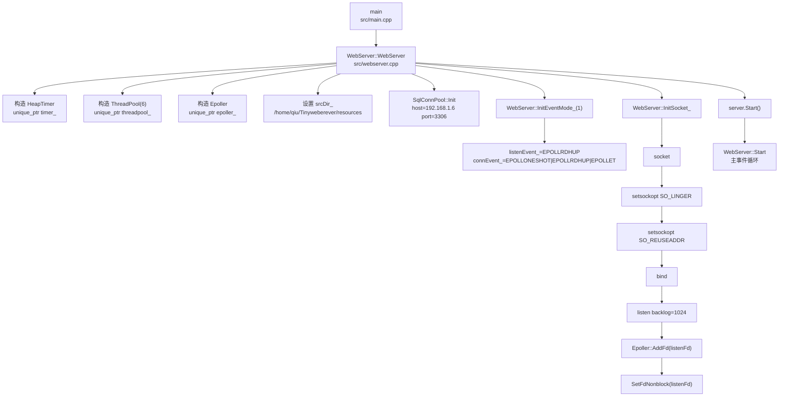

真实顺序补充：

- `Log::init` 只有 `openLog=true` 才调用；当前 main 传 `false`。
- `SqlConnPool::Init` 在 `InitEventMode_` 和 `InitSocket_` 之前。
- `InitSocket_` 失败会设置 `isClose_=true`。

## 2. 新连接建立图

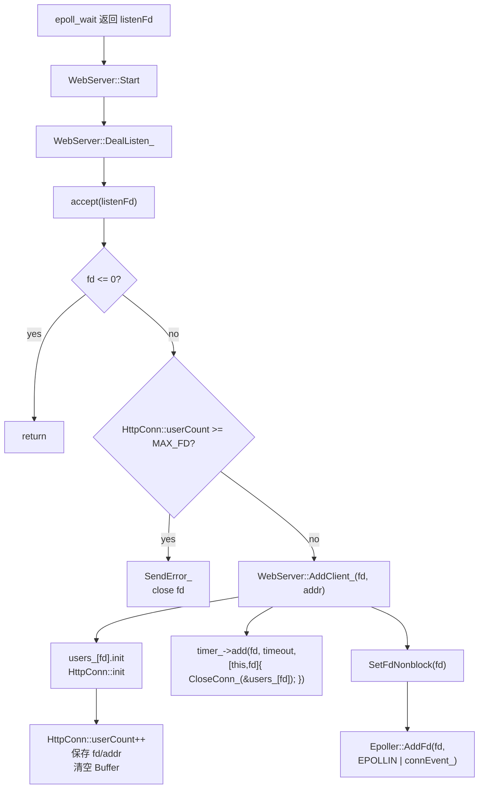

关键成员变量：

- `WebServer::users_`：`unordered_map<int, HttpConn>`
- `WebServer::timer_`
- `WebServer::epoller_`
- `HttpConn::fd_`
- `HttpConn::readBuff_`、`writeBuff_`

风险：timer 回调捕获 fd，worker 任务捕获 `HttpConn*`，无 generation 防护。

## 3. GET 静态文件请求图

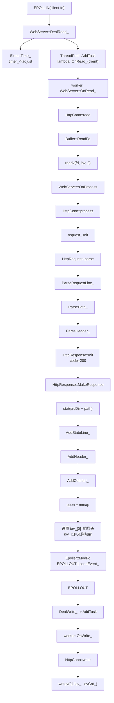

写完后：

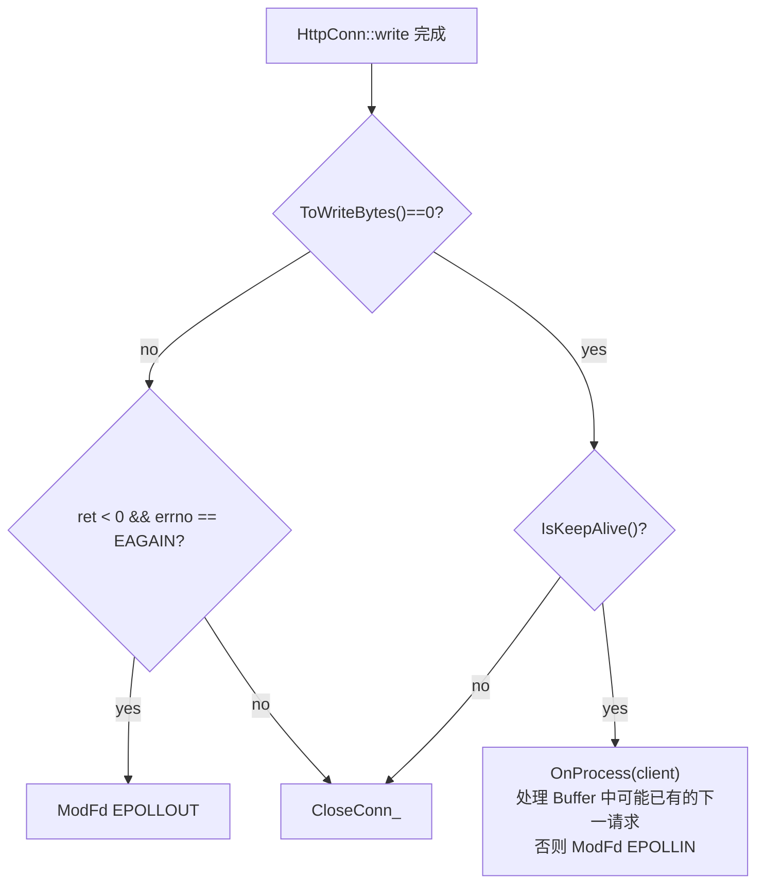

## 4. POST 登录图

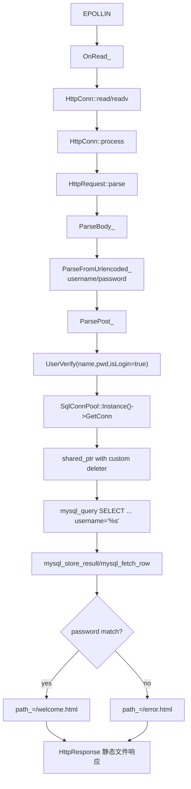

注册路径：

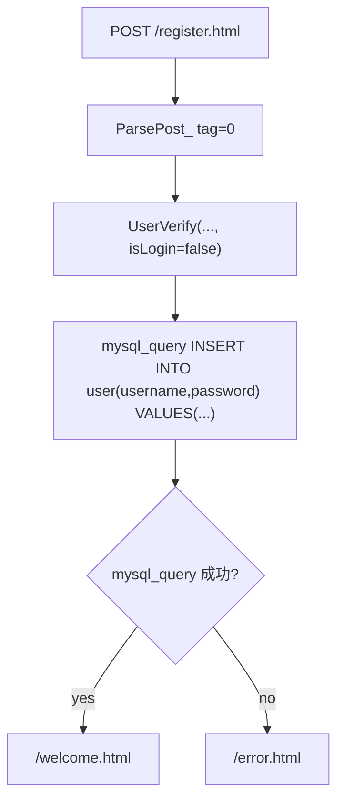

安全边界：SQL 由 `snprintf` 拼接，当前没有 prepared statement。

## 5. 超时关闭图

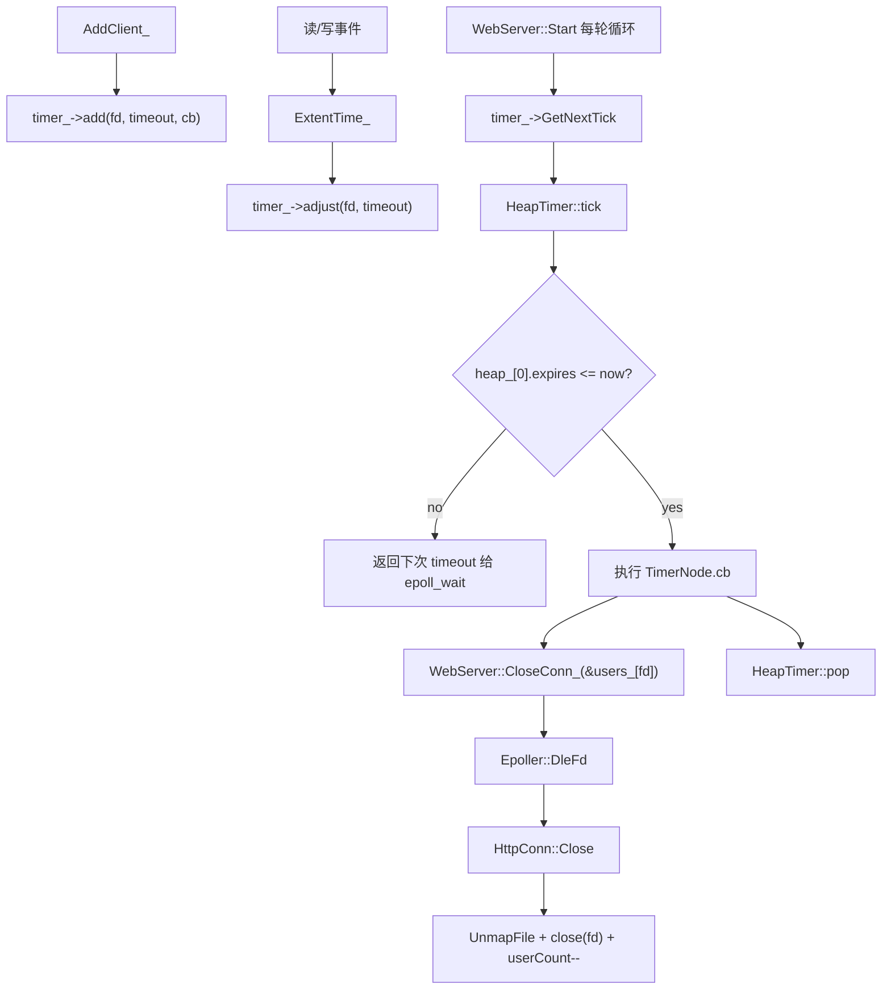

风险：`CloseConn_` 不主动从 timer 删除；fd 复用没有 generation。

## 6. Keep-Alive 状态图

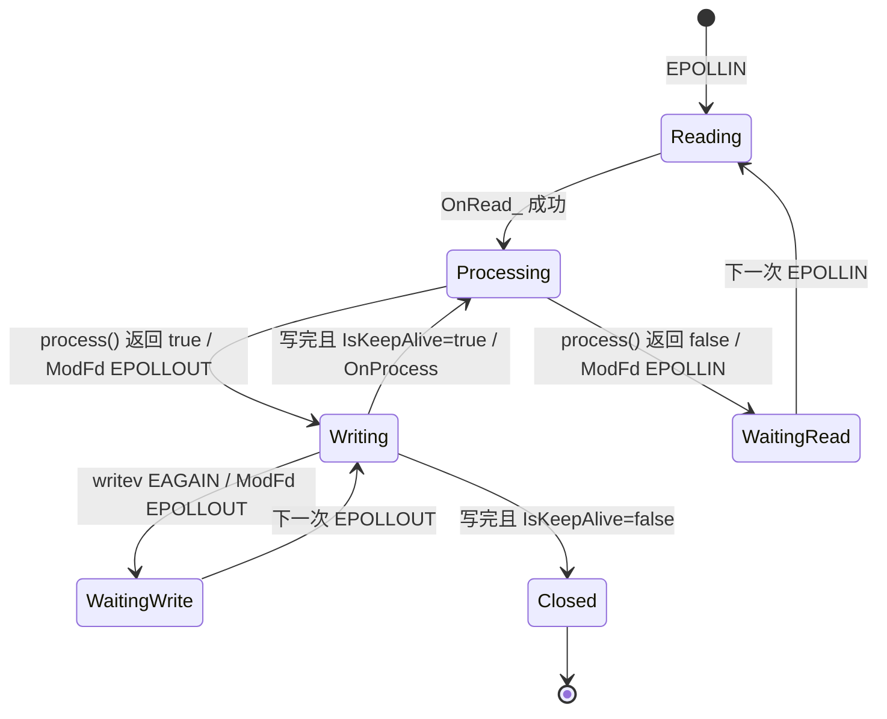

Keep-Alive 判定源码：

```text
HttpRequest::IsKeepAlive:
header_ contains "Connection"
&& header_["Connection"] == "keep-alive"
&& version_ == "1.1"
```

因此不是完整 HTTP/1.1 默认 keep-alive 语义。

## 7. 线程关系图

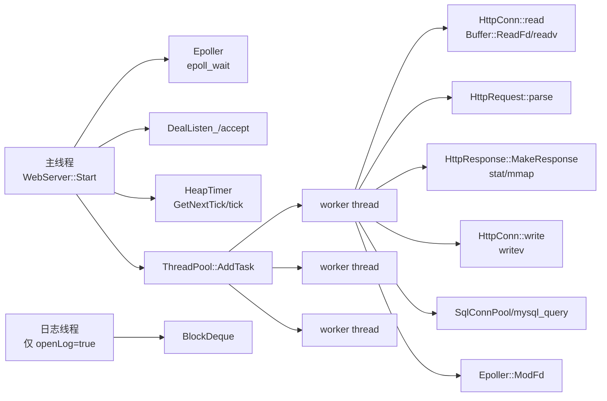

共享资源审计：

| 资源 | 访问线程 | 锁 | 风险 |
| --- | --- | --- | --- |
| `users_` | 主线程、timer 回调、worker 间接使用指针 | 无 | 指针悬空、fd 复用、数据竞争 |
| `epoller_` | 主线程 wait/add/del，worker mod | 无对象锁；epoll_ctl 内核线程安全 | 生命周期和事件顺序风险 |
| `timer_` | 主线程为主 | 无 | 与 worker 处理同 fd 竞争 |
| `SqlConnPool` | worker | mutex + semaphore | close 时 borrowed connection 风险 |
| `ThreadPool::tasks` | 主线程/worker | mutex + cv | 无界队列，无优雅退出 |
| `Log` | 多线程 | mutex + 队列 | 默认未启用；队列满可能同步阻塞 |

## 8. 对象生命周期图

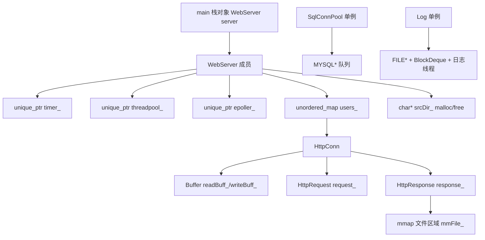

析构路径：

```text
WebServer::~WebServer
-> isClose_=true
-> close(listenFd_)
-> free(srcDir_)
-> SqlConnPool::ClosePool()
-> unique_ptr 成员析构
```

不完整 RAII：

- `listenFd_` 手动 close
- `srcDir_` 手动 malloc/free
- `HttpConn` 手动 `Close`
- `ThreadPool` detached 线程不 join
- worker lambda 捕获裸指针

## 9. 一页 ASCII 总图

```text
main
 |
 v
WebServer 构造
 |-- ThreadPool(6 detached workers)
 |-- Epoller(epoll_create)
 |-- HeapTimer
 |-- SqlConnPool(12 MySQL connections)
 |-- InitEventMode(trigMode=1)
 '-- InitSocket(socket/bind/listen/add listen fd)
 |
 v
Start 主循环
 |-- timeout = timer.GetNextTick()
 |-- epoll_wait(timeout)
 |-- listen fd -> accept -> AddClient -> timer.add -> epoll add EPOLLIN
 |-- EPOLLIN   -> AddTask -> worker readv -> parse -> response/mmap -> ModFd EPOLLOUT
 |-- EPOLLOUT  -> AddTask -> worker writev -> keepalive ? process next : close
 '-- ERR/RDHUP/HUP -> CloseConn
```

## 10. 缺陷关系图

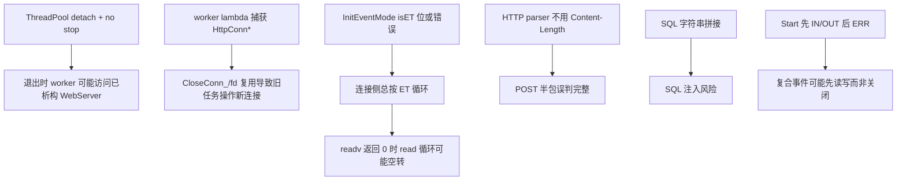
